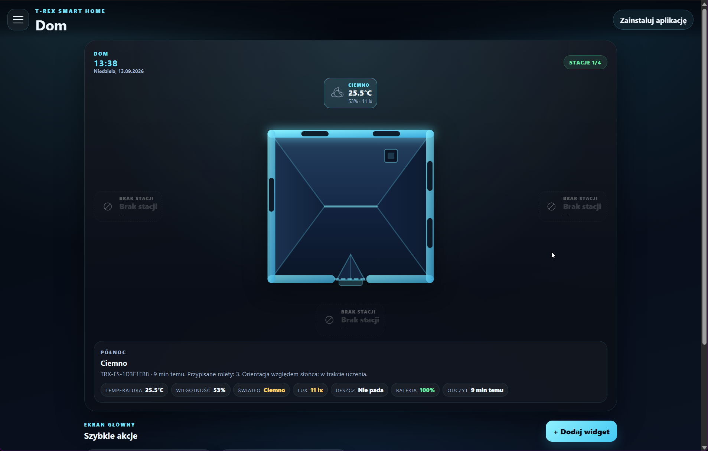
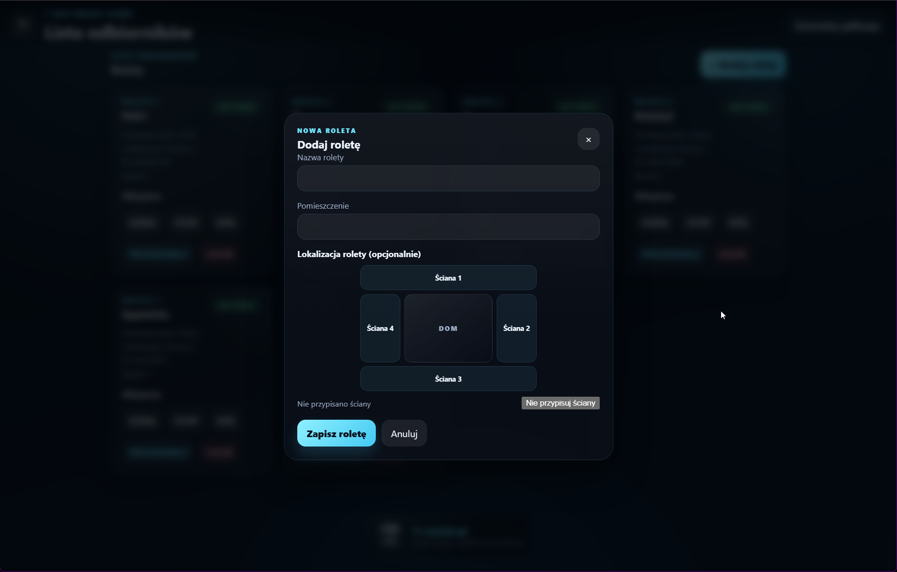
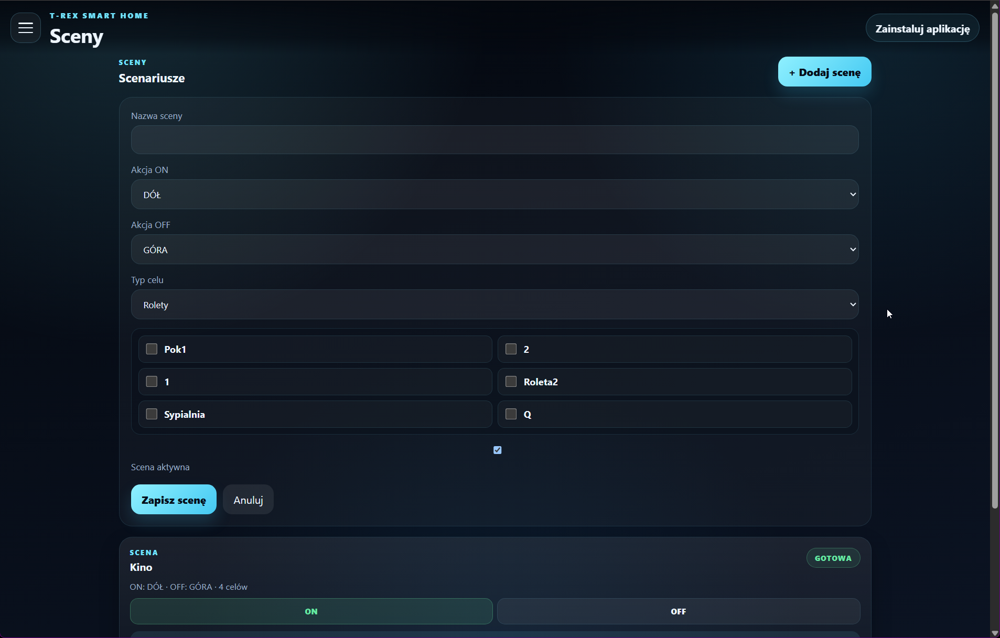
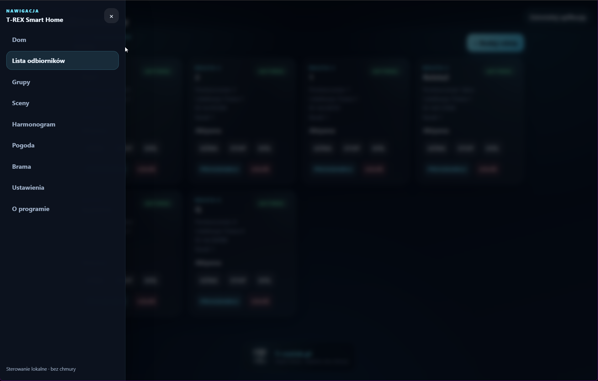
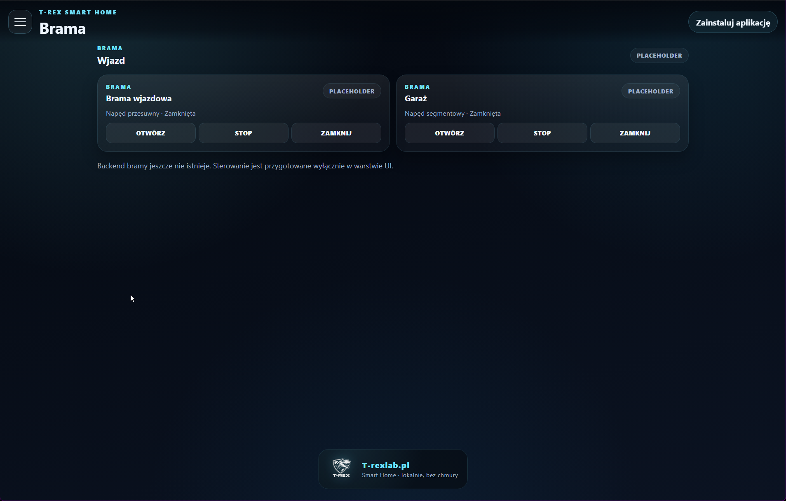
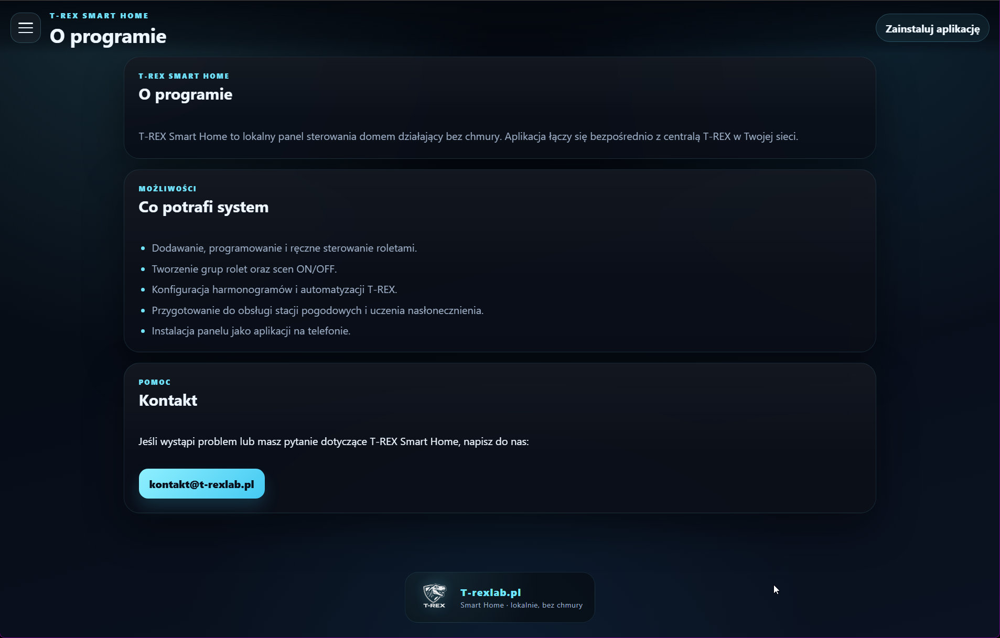

# Product gallery

These screenshots present selected functions of the local T-REX HOME web
interface. They are documentation material only: this public repository does
not contain controller firmware or source code.

The gallery intentionally omits screenshots that contain real local addresses,
Wi-Fi network names, weather-station addresses or roller receiver identifiers.

## Home dashboard

The dashboard brings together facade context, local weather information and
quick actions.

## Shutter and scene configuration

Wall assignment is part of configuring a shutter and is independent from a
geographic direction.

Scenes provide user-defined ON and OFF actions for selected shutters.

## Navigation and planned modules

The navigation groups the local control, weather, scenes and configuration
views.

Gate control is shown as a planned interface area; its backend is not part of
the public documentation package.

The local-first philosophy and support contact are available from the About
view.

Polish version: [gallery_PL.md](gallery_PL.md).
